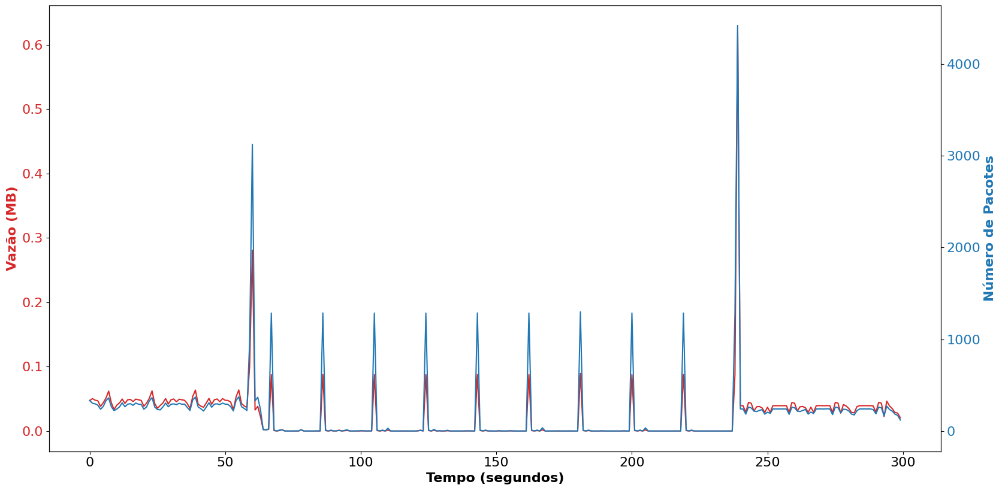
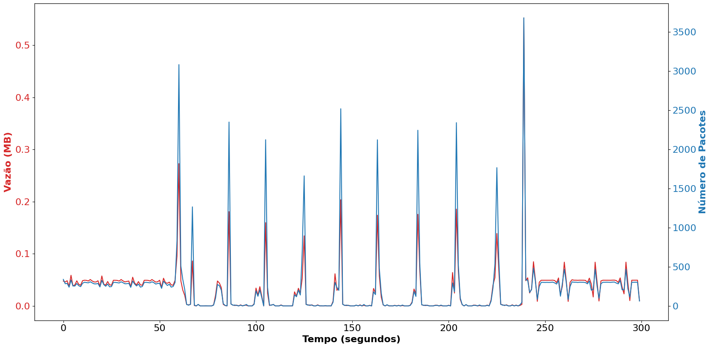

# demo-wtestbed-csbc-2024

Esse repositório tem como principal apresentar a demo **Analisando ataques Slowloris com o MENTORED _Testbed_** apresentado no evento WTestbed CSBC 2024.

Os slides utilizados para apresentar a demo estão disponível em [./doc/csbc2024_wtestbed_slide_presentation.pdf](./doc/csbc2024_wtestbed_slide_presentation.pdf)

## Criando seu experimento de segurança no MENTORED _Testbed_

Diversos testbeds focados em cibersegurança oferecem soluções para realizar experimentos.
Neste repositório estão disponíveis os arquivos e descrições necessárias para realizar dois tipos de experimentos no [MENTORED Testbed](https://portal.mentored.ccsc-research.org/).

Você pode seguir as instruções oficiais do Testbed para executar seu experimento neste link: [https://portal.mentored.ccsc-research.org/tutorial/](https://portal.mentored.ccsc-research.org/tutorial/) 


### Criação de containers Docker

Esta etapa é quase integralmente definida por quem deseja realizar o experimento.

Quatro containers Dockers foram previamente criados e estão disponíveis no diretório `docker-images`.


Este minicurso assume que você já tenha o conhecimento da tecnologia Docker para definir containers.

Contudo, o MENTORED Testbed fornece diversas facilidades para realizar os experimentos, incluíndo mecanismos de sincronização para início de experimento, criação de arquivos com lista de IPs, entre outras vantagens que reduzem o tempo necessário para definir um experimento.

Uma maneira de acessar essas vantagens é utilizar as imagens disponíveis publicamente. Por exemplo: `ghcr.io/mentoredtestbed/generic-botnet`.

Essas imagens também podem ser usadas como base para criar uma versão extendida customizada. Por exemplo:

```Dockerfile
FROM ghcr.io/mentoredtested/mentored-base

RUN pip3 install --break-system-packages numpy

COPY ./client_web_metrics.py /
```


### Definições de experimentos

Neste repositório você poderá ver dois arquivos YAML: `experiment-definitions/slowloris-ataque-n1.yaml` e `experiment-definitions/slowloris-ataque-n2.yaml`.

Esses arquivos consideram uma sintaxe que compartilha elementos com a [sintaxe da tecnologia](experiment-definitions) para definir containers.


Esses arquivos descrevem dois ataques DDoS considerando o seguinte cenário:

#### Slowloris - Ataque nº 1
  - 1 servidor Apache com **configuração padrão** sendo executado em um servidor em **Goiás** (`ids-go`)
  - Além do servidor Apache, um segundo container é usado para monitorar o tráfego de rede com o software `tshark`
  - 30 clientes em **Pernambuco** (`ids-pe`) acessando o servidor Apache com requisições web (HTTP) a cada 1 segundo
  - Os clientes salvam o tempo de solicitação de cada requisição
  - O tempo da solicitação pode ser usado para mensurar a disponibilidade do servidor Apache
  - 10 nós em **Rio de Janeiro** (`ids-rj`) atacando o servidor Apache usando os ataques DDoS slowloris

#### Slowloris - Ataque nº 2
  - 1 servidor Apache com o **módulo _mod_reqtimeout_ habilitado** sendo executado em um servidor em **Goiás** (`ids-go`)
  - Além do servidor Apache, um segundo container é usado para monitorar o tráfego de rede com o software `tshark`
  - 30 clientes em **Pernambuco** (`ids-pe`) acessando o servidor Apache com requisições web (HTTP) a cada 1 segundo
  - Os clientes salvam o tempo de solicitação de cada requisição
  - O tempo da solicitação pode ser usado para mensurar a disponibilidade do servidor Apache
  - 10 nós em **Rio de Janeiro** (`ids-rj`) atacando o servidor Apache usando os ataques DDoS slowloris

Linha do tempo (segundos):
- **0 - 60**: Os containers iniciam, o server fica disponível e os clientes iniciam suas requisições
- **60 - 240**: Os atacantes **iniciam o DDoS** enquanto os clientes continuam tentando acessar o servidor
- **240 - 300**: O ataque acaba e os clientes continuam tentando acessar o servidor


Para definir os softwares e configurações que serão executadas em cada nós, é necessário criar a lista de `containers` equivalente a uma definiçãod e Pods no Kubernetes. Por exemplo:

```yaml
containers:
  - name: 'client-rn'
    image: ghcr.io/mentoredtestbed/generic-client:latest
    imagePullPolicy: "Always"
    command: ["/entry.sh"]
    args: ['python3', 'client_web_metrics.py', "1", "1"]
    env:
      - name: TIMEOUT_CMD
        value: "60"
      - name: ADD_SERVER_IP_TO_COMMAND
        value: "true"
    securityContext:
      privileged: true
    resources:
      requests:
        memory: "64Mi"
        cpu: "100m"
      limits:
        memory: "128M"
        cpu: "200m"
```


As outras partes do arquivo YAML são utilizadas pelo MENTORED _Testbed_ para controlar o experimento. Por exemplo, a linha `persitent_volume_path: "/app/packets.pcap"` indica o testbed irá salvar esses arquivos após a conclusão do experimento. 


### Execuções dos experimentos
Siga o [Tutorial](https://portal.mentored.ccsc-research.org/tutorial/) do MENTORED Testbed para fazer upload e executar uma das definições de experimentos deste repositório.

Na página de [execução de experimentos](https://portal.mentored.ccsc-research.org/execution), aguarde seu experimento encerrar.

Quando o experimento finalizar, você poderá baixar os resultados em um formato `.tar.gz`.


### Análise dos resultados

Nos experimentos considerados neste minicurso, dois principais arquivos são salvos:
- `packets.pcap`: Captura de tráfego de rede
- `client_delay.csv`: Mensuramento da disponibilidade de serviço (para cada cliente)

Este repositório contém ferramentas para gerar análises simples sobre esses dados.

Baixe o arquivo `.tar.gz` e oo copie para este diretório. Por exemplo:

```bash
MY_EXP_FILE=experiment_290.tar.gz
cp ~/Downloads/$MY_EXP_FILE .
```

Execute o script para obter a análise dos clientes:
```bash
cd clients-analysis
./create_client_metrics.sh ../$MY_EXP_FILE 20 30
```

Para o ataque nº 1 você verá algo semelhante a esse log:
```
Extracted ../experiment_384.tar.gz
Running experiment analyzer...
100%|███████████████████████████| 30/30 [00:00<00:00, 7122.67it/s]
Average time for client response (Before 60 seconds)    : 0.066
Average time for client response (60 - 240 seconds)      : 110.599
Average time for client response (After 240 seconds)     : 0.066
Experiment analyzer finished

```
Para o ataque nº 2 você verá algo semelhante a esse log:
```
Extracted ../experiment_385.tar.gz
Running experiment analyzer...
100%|██████████████████████████| 30/30 [00:00<00:00, 3695.10it/s]
Average time for client response (Before 60 seconds)    : 0.066
Average time for client response (60 - 240 seconds)      : 43.005
Average time for client response (After 240 seconds)     : 0.067
Experiment analyzer finished

```

Nos logs anteriores, três intervalos (grupos) foram considerados: Pré-ataque, Ataque e pós-ataque. A média de cada grupo representa o tempo médio no intervalo para obter uma resposta do servidor.

Agora, troque de diretório e execute o script para analizar os resultados do tráfego de rede: 

```bash
cd ..
cd server-analysis
./create_server_metrics.sh ../$MY_EXP_FILE
```

Para o ataque nº 1 você verá uma imagem semelhante a essa:



Para o ataque nº 2 você verá uma imagem semelhante a essa:


## Considerações finais

Os experimentos apresentados nesta demo servem como exemplos didáticos para explicar o MENTORED _Testbed_. Apesar de simples, a definição desses experimentos nos permite observar o potencial e facilidade para criar outros experimentos mais complexos com cenários variados no _testbed_, que conta com uma infraestrutura baseada no Cluster Nacional da RNP.

Caso tenha alguma dúvida ou deseja entrar em contato, basta mandar um email para [mentored.project@gmail.com](mailto:mentored.project@gmail.com)
